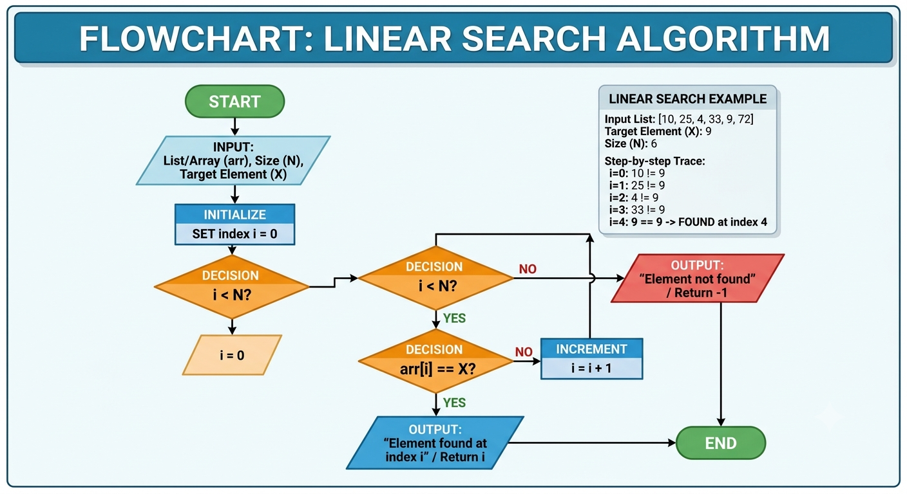
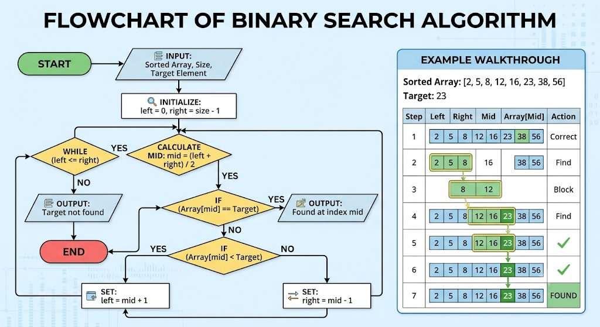
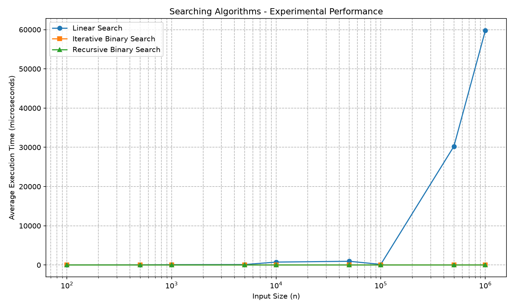

# Algorithm Performance Analyzer – Searching Algorithms

## 1. Problem Statement

The objective of this project is to develop an Algorithm Performance Analyzer that compares the theoretical and experimental performance of different searching algorithms.

The following searching algorithms are implemented and analyzed:

1. Linear Search
2. Iterative Binary Search
3. Recursive Binary Search

The analyzer studies their best-case, average-case, and worst-case time complexity and space complexity. It also measures their actual execution time for different input sizes and generates performance graphs for comparison.

---

## 2. Algorithm / Approach

### 2.1 Linear Search

Linear Search checks each element of an array sequentially until the target element is found or the array ends.

**Approach:**

1. Start from the first element.
2. Compare the current element with the target.
3. If the element matches, return its index.
4. Otherwise, move to the next element.
5. If the target is not found, return `-1`.

### 2.2 Iterative Binary Search

Binary Search works on a sorted array by repeatedly dividing the search range into two halves.

**Approach:**

1. Set `low` to the first index and `high` to the last index.
2. Calculate the middle index.
3. Compare the middle element with the target.
4. If they are equal, return the index.
5. If the target is greater, search the right half.
6. If the target is smaller, search the left half.
7. Continue until the target is found or the search range becomes empty.

### 2.3 Recursive Binary Search

Recursive Binary Search uses the same divide-and-conquer approach as iterative binary search, but the search operation is performed through recursive function calls.

**Approach:**

1. Check whether `low > high`.
2. If true, return `-1`.
3. Calculate the middle index.
4. Compare the middle element with the target.
5. If equal, return the index.
6. If the target is greater, recursively search the right half.
7. Otherwise, recursively search the left half.

---

## 3. Pseudocode

### 3.1 Linear Search

```text
LINEAR_SEARCH(array, target)

for i = 0 to n - 1
    if array[i] == target
        return i

return -1
```

### 3.2 Iterative Binary Search

```text
BINARY_SEARCH_ITERATIVE(array, target)

low = 0
high = n - 1

while low <= high

    mid = (low + high) / 2

    if array[mid] == target
        return mid

    else if array[mid] < target
        low = mid + 1

    else
        high = mid - 1

return -1
```

### 3.3 Recursive Binary Search

```text
BINARY_SEARCH_RECURSIVE(array, target, low, high)

if low > high
    return -1

mid = (low + high) / 2

if array[mid] == target
    return mid

else if array[mid] < target
    return BINARY_SEARCH_RECURSIVE(
        array, target, mid + 1, high
    )

else
    return BINARY_SEARCH_RECURSIVE(
        array, target, low, mid - 1
    )
```

## Flow Chart

*** Linear Search flowchart ***




*** Binary Search Flowchart ***



---

## 4. Time & Space Complexity Analysis

| Algorithm               | Best Case | Average Case | Worst Case | Space Complexity |
| ----------------------- | --------- | ------------ | ---------- | ---------------- |
| Linear Search           | O(1)      | O(n)         | O(n)       | O(1)             |
| Iterative Binary Search | O(1)      | O(log n)     | O(log n)   | O(1)             |
| Recursive Binary Search | O(1)      | O(log n)     | O(log n)   | O(log n)         |

### Explanation

**Linear Search:**
The best case occurs when the target is the first element. In the average and worst cases, multiple or all elements may need to be checked.

**Iterative Binary Search:**
The search space is divided by two after every iteration, resulting in logarithmic time complexity.

**Recursive Binary Search:**
The time complexity is also O(log n), but recursive function calls require additional stack memory, resulting in O(log n) auxiliary space.

---

## 5. Sample Input / Output

### Sample Input

```text
Array = [10, 20, 30, 40, 50, 60, 70]
Target = 40
```

### Sample Output

```text
Linear Search Index = 3
Iterative Binary Search Index = 3
Recursive Binary Search Index = 3
```

Another example when the element is not present:

```text
Array = [10, 20, 30, 40, 50]
Target = 25
```

Output:

```text
Linear Search Index = -1
Iterative Binary Search Index = -1
Recursive Binary Search Index = -1
```

---

## 6. Screenshots / Graphs

The performance graph generated by the notebook compares the execution time of:

* Linear Search
* Iterative Binary Search
* Recursive Binary Search

The graph plots input size against average execution time.

The generated graph is saved as:

```text
searching_performance.png
```



---

## 7. Experimental Results

The algorithms were tested using different input sizes such as:

```text
100
500
1000
5000
10000
50000
100000
500000
1000000
```

Each algorithm was executed multiple times and the average execution time was calculated to reduce measurement noise.

The experimental results are stored in:

```text
searching_results.csv
```

### Expected Observation

Linear Search generally takes more time as the input size increases because its average and worst-case complexity is O(n).

Both Iterative Binary Search and Recursive Binary Search increase much more slowly because their time complexity is O(log n).

The recursive implementation may take slightly more time than the iterative implementation because recursive function calls introduce additional overhead.

Actual execution times can vary depending on the processor, Python interpreter, system load, memory, and other environmental factors.

---

## 8. Learning Outcomes

After completing this project, the following concepts were learned:

* Understanding theoretical time complexity.
* Understanding best-case, average-case, and worst-case analysis.
* Understanding space complexity.
* Implementing Linear Search.
* Implementing Iterative Binary Search.
* Implementing Recursive Binary Search.
* Understanding the difference between iterative and recursive approaches.
* Measuring actual algorithm execution time.
* Comparing theoretical complexity with experimental performance.
* Storing experimental results in CSV format.
* Creating performance graphs using Python.
* Understanding that practical execution time can differ from theoretical Big-O analysis.
