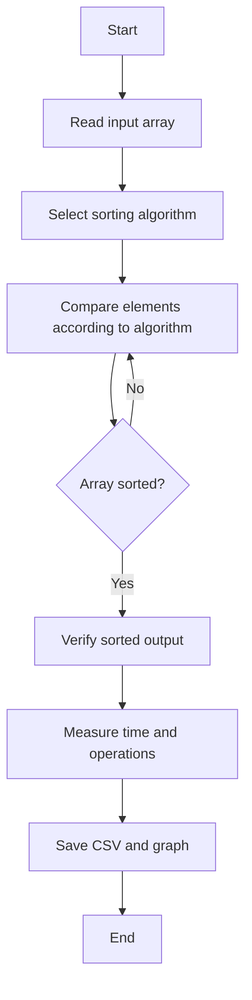

# Sorting Algorithms and Performance Analysis

## 1. Problem Statement

Implement and analyze common sorting algorithms that arrange an array in non-decreasing order. The folder contains:

1. Bubble Sort
2. Recursive Bubble Sort
3. Insertion Sort
4. Selection Sort
5. Merge Sort
6. Quick Sort
7. Heap Sort

The [Sorting Performance Comparison System](sorting_performance_comparison.py)
compares Merge Sort, Quick Sort, and Heap Sort using the same random inputs.
It verifies sorted output, measures average execution time for different input
sizes, saves the comparison results as CSV, and generates an `n` versus time
plot.

The programs sort data in place where appropriate, verify correctness, measure execution time, count operations, save experimental results as CSV files, and generate performance graphs.

## 2. Algorithm / Approach

### Bubble Sort

Repeatedly compare adjacent elements and swap them when they are out of order. After each pass, the largest remaining element reaches the end of the unsorted portion. The implementation stops early when a pass makes no swaps.

### Recursive Bubble Sort

Perform one bubble-sort pass, then recursively sort the remaining prefix. The recursion stops when the prefix has at most one element or when a pass makes no swaps. The notebook implementation is in [sorting_analysis.ipynb](sorting_analysis.ipynb).

### Insertion Sort

Build the sorted portion from left to right. Each new element is shifted left until it reaches its correct position.

### Selection Sort

For each position, find the smallest element in the remaining unsorted portion and swap it into place.

### Merge Sort

Divide the array into two halves, recursively sort both halves, and merge the sorted halves. A temporary work array is used for merging.

### Quick Sort

Choose a median-of-three pivot, partition the array around that pivot, and recursively sort the two partitions.

### Heap Sort

Build a max heap, repeatedly move the maximum element to the end of the array,
and restore the heap property for the remaining elements.

## 3. Pseudocode / Flowchart

### Recursive Bubble Sort Pseudocode

```text
RECURSIVE_BUBBLE_SORT(array, end)

if end is not provided
    end = length(array) - 1

if end <= 0
    return

swapped = false

for index = 0 to end - 1
    compare array[index] and array[index + 1]
    if array[index] > array[index + 1]
        swap them
        swapped = true

if swapped is false
    return

RECURSIVE_BUBBLE_SORT(array, end - 1)
```

### General Sorting Flowchart



## 4. Time & Space Complexity Analysis

| Algorithm | Best Time | Average Time | Worst Time | Auxiliary Space |
| --- | --- | --- | --- | --- |
| Bubble Sort | O(n) | O(n^2) | O(n^2) | O(1) |
| Recursive Bubble Sort | O(n) | O(n^2) | O(n^2) | O(n) |
| Insertion Sort | O(n) | O(n^2) | O(n^2) | O(1) |
| Selection Sort | O(n^2) | O(n^2) | O(n^2) | O(1) |
| Merge Sort | O(n log n) | O(n log n) | O(n log n) | O(n) |
| Quick Sort | O(n log n) | O(n log n) | O(n^2) | O(log n) average |
| Heap Sort | O(n log n) | O(n log n) | O(n log n) | O(1) |

Recursive bubble sort uses O(n) call-stack space because each pass creates one recursive call. Merge sort uses a temporary array, while quick sort's stack usage depends on partition balance.

## 5. Sample Input / Output

### Sample Input

```text
Array = [64, 34, 25, 12, 22, 11, 90]
```

### Sample Output

```text
Sorted array = [11, 12, 22, 25, 34, 64, 90]
```

The analyzer also reports average execution time, comparisons, and swaps or writes for each input case.

## 6. Screenshots / Graphs

The generated performance graphs compare runtime and operation counts for sorted, random, and reverse-sorted inputs.

- [Merge Sort performance graph](merge_sort_performance.png)
- [Quick Sort performance graph](quick_sort_performance.png)
- [Selection Sort performance graph](selection_sort_performance.png)
- [Recursive bubble sort performance graph](recursive_bubble_sort_performance.png)
- [Sorting comparison performance graph](sorting_comparison_performance.png)

The standalone `bubble_sort.py` and `insertion_sort.py` files provide basic implementations; the reusable analyzer pattern is demonstrated by the other scripts and notebook.

## 7. Experimental Results

The analyzer scripts use deterministic random input generation and repeat each measurement to calculate average values. Results are stored in the following CSV files:

- [Merge Sort results](merge_sort_results.csv)
- [Quick Sort results](quick_sort_results.csv)
- [Selection Sort results](selection_sort_results.csv)
- [Recursive bubble sort results](recursive_bubble_sort_results.csv)
- [Sorting comparison results](sorting_comparison_results.csv)

The experiments include sorted, random, and reverse-sorted inputs. Expected observations are:

- Bubble, insertion, and selection sort require quadratic time for typical large inputs.
- Merge sort grows approximately as O(n log n) across input cases.
- Quick sort is generally fast, but its performance depends on partition quality.
- Already sorted input benefits from the early-exit condition in bubble sort and recursive bubble sort.
- Measured times vary with hardware, Python version, and system load.

The comparison system uses one seeded random input per value of `n`, gives that
same input to all three algorithms, repeats each timing, and reports the mean
execution time. The graph and CSV are generated by running:

```bash
python sorting_performance_comparison.py
```

## 8. Learning Outcomes

After completing this project, the following concepts were learned:

- Implementing and comparing multiple sorting algorithms.
- Applying recursion to bubble sort.
- Writing pseudocode and representing algorithm flow.
- Analyzing best-case, average-case, and worst-case complexity.
- Distinguishing auxiliary space from input storage.
- Measuring execution time and operation counts experimentally.
- Validating sorted output against a reference result.
- Saving experimental data as CSV and presenting results with graphs.
- Relating theoretical complexity to observed program behavior.
